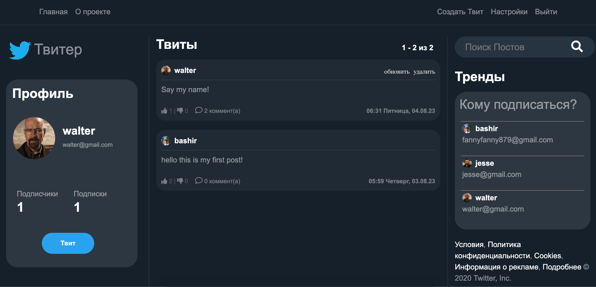

# twiter_clone

Веб приложение с возможностью выкладывать посты, ставить комментарии, лайки, дизлайки. Также есть возможность подписаться и отписаться от пользователя.

## Installation

First of all you need to download all the files in this repo to your computer. Then you need to create and run a virtual environment with these commands:

On Mac OS and Linux:
```bash
# create environment with name venv
virtualenv venv -p python3
# runing venv enviroment
source venv/bin/activate
```

On Windows:
```bash
# create environment with name env
python -m venv env
# runing env enviroment
env\Scripts\activate
```

The next step is to install the necessary modules. This command will help:
```bash
pip install -r requirements.txt
```


## Project pictures




## Contributing

Pull requests are welcome. For major changes, please open an issue first
to discuss what you would like to change.

Please make sure to update tests as appropriate.

## Project Goals
This code was written for educational purposes.

## Contacts

You can find my on telegram: https://t.me/bashir_77
